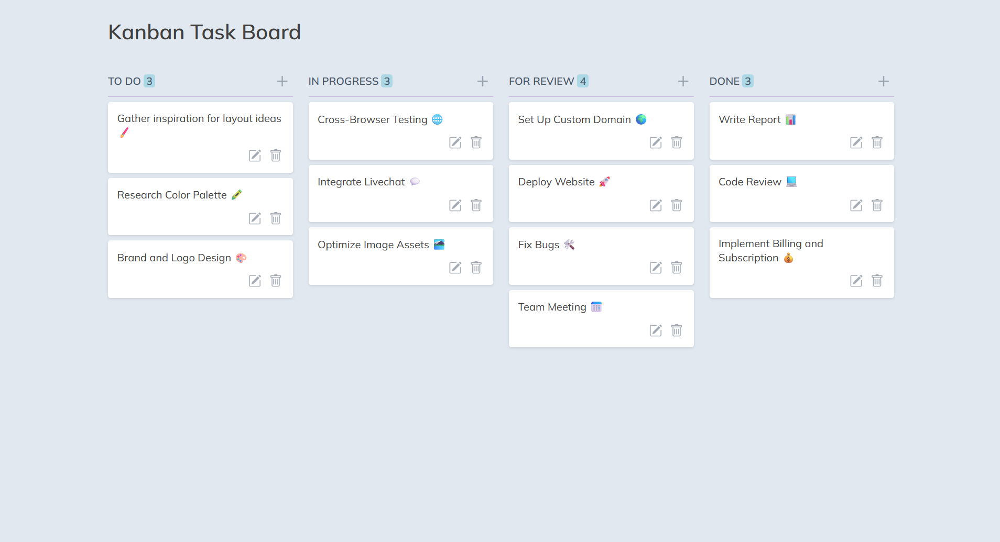
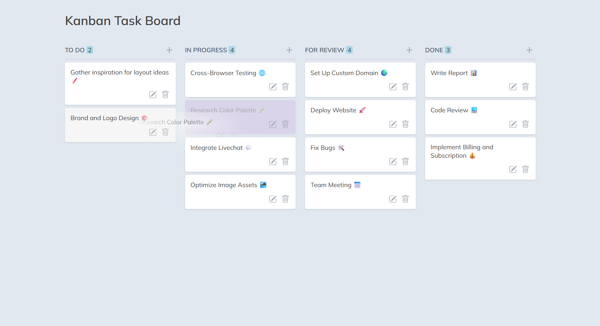
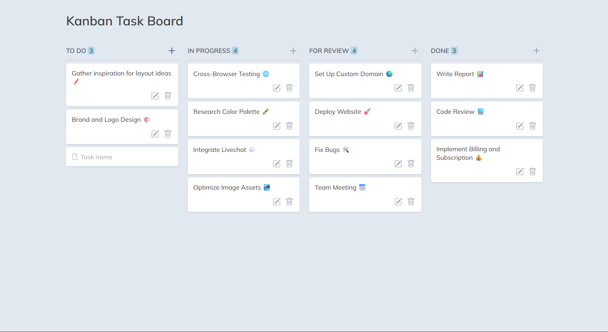
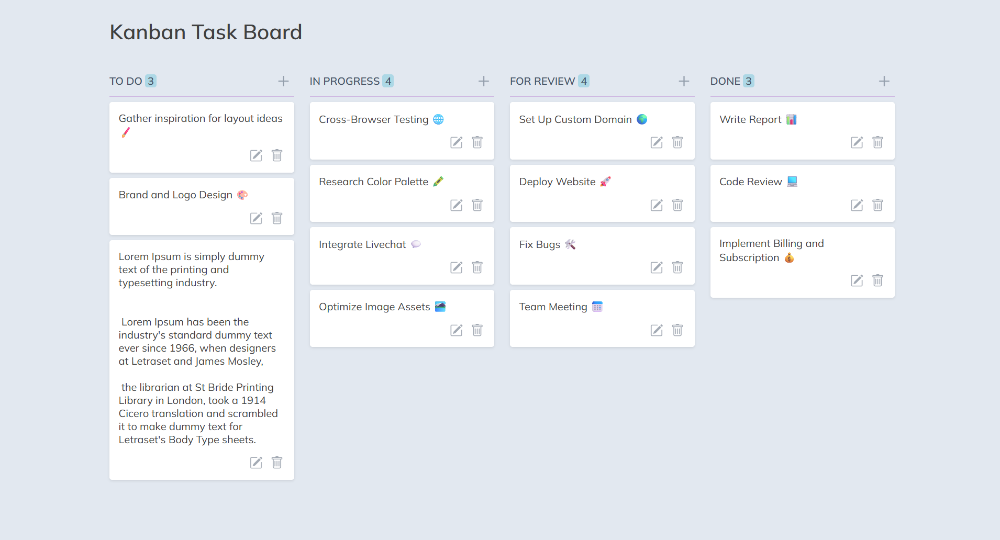
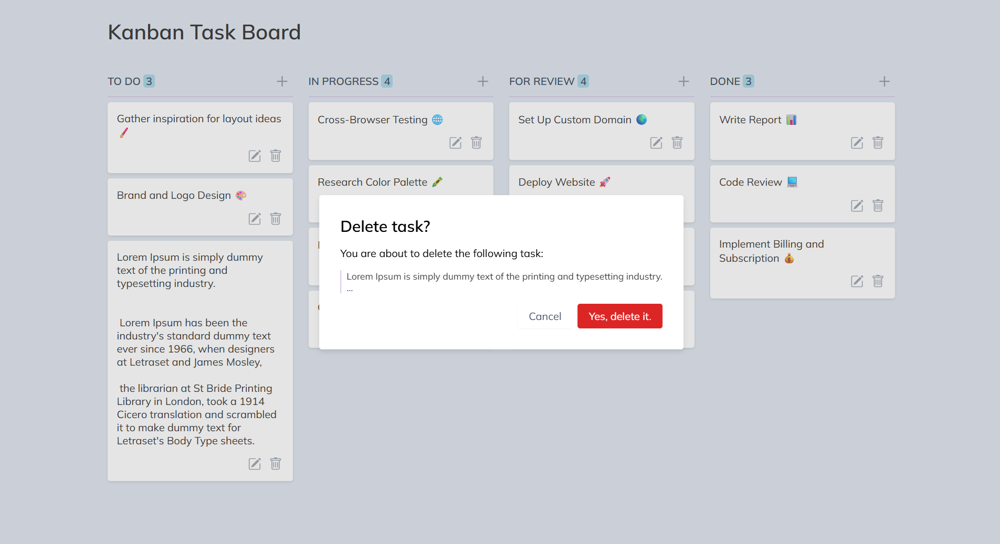

# Kanban Task Board

A lightweight Kanban task board built with vanilla JavaScript.

Create, edit, delete and reorder tasks with drag and drop, and move them between workflow columns.

## Screenshots

## Features

- Create, edit and delete tasks
- Enter to save a task, Shift+Enter for a new line
- Multiline tasks
- Drag and drop between columns and reordering within a column
- Delete confirmation modal
- Live task counter for each column
- Safe rendering of user input (no HTML injection)

## Tech Stack

- HTML5
- CSS3 (nesting, custom properties)
- JavaScript (ES6+)
- HTML Drag and Drop API
- MutationObserver
- HTML `<dialog>` element

## What I Practiced

- DOM manipulation and dynamic element creation
- Event delegation and event handling
- Drag and Drop API
- MutationObserver
- Content editing with `contentEditable`
- Native HTML dialogs
- Working with dynamic UI state
- Safe handling of user input (`textContent` instead of `innerHTML`)
